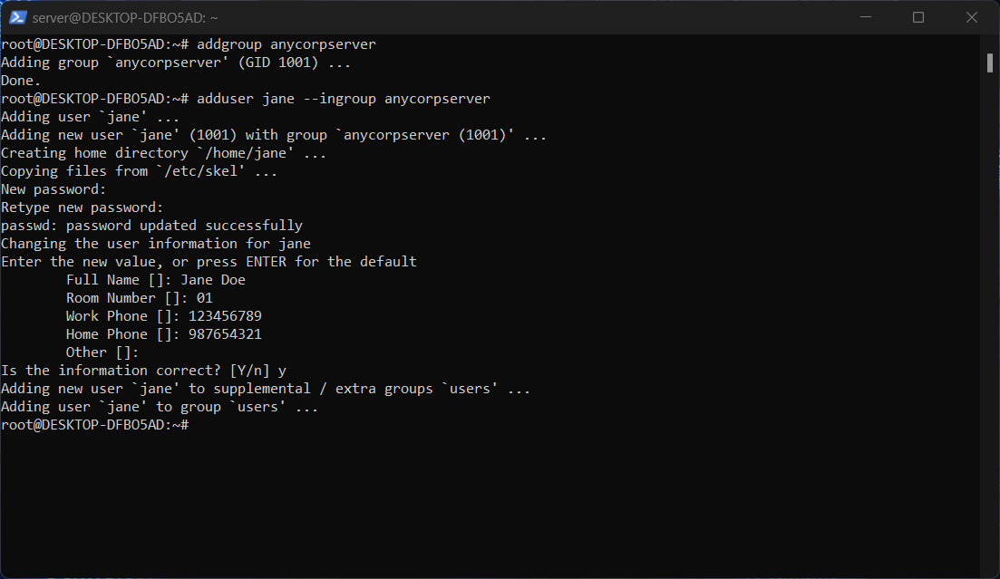
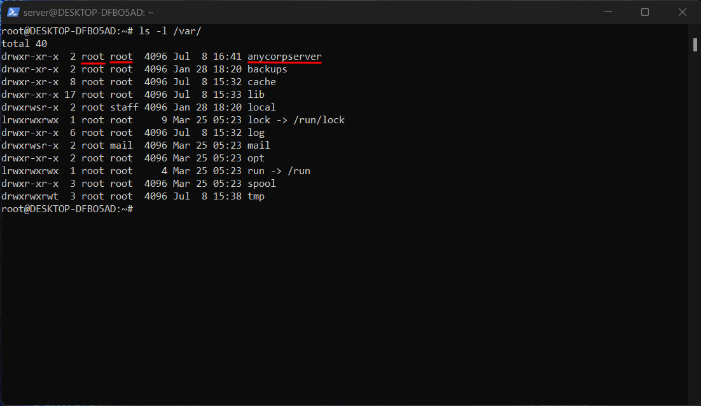
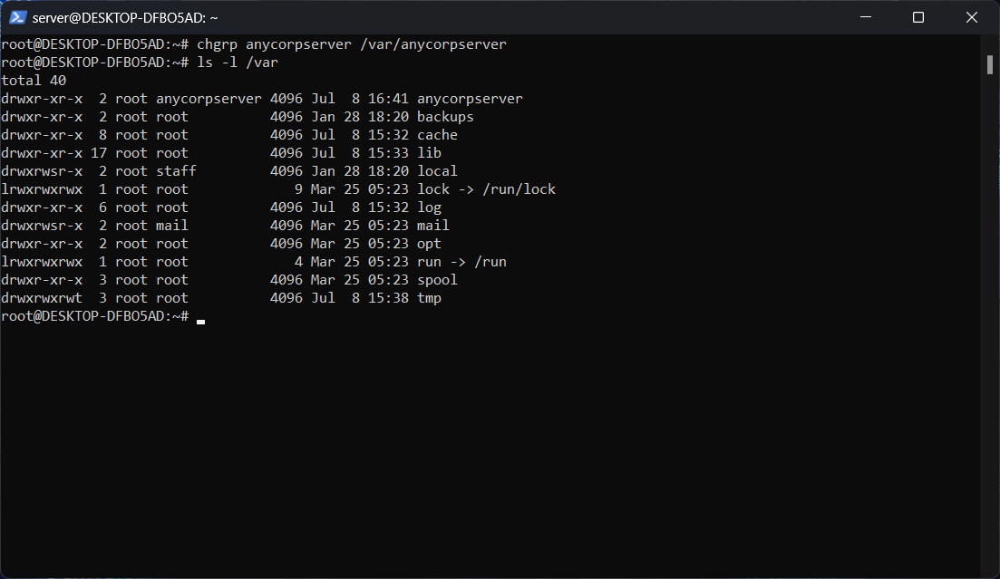
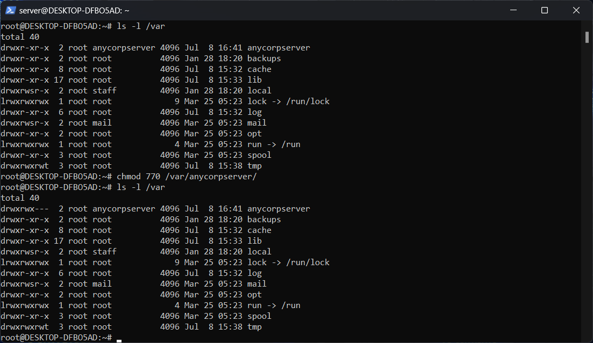
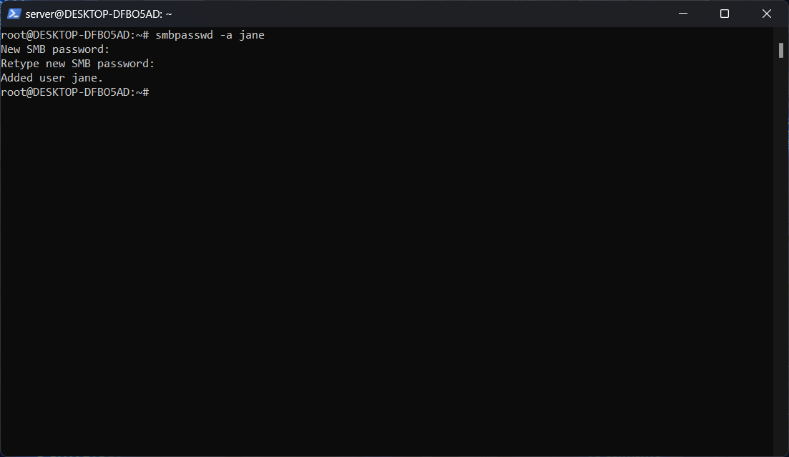
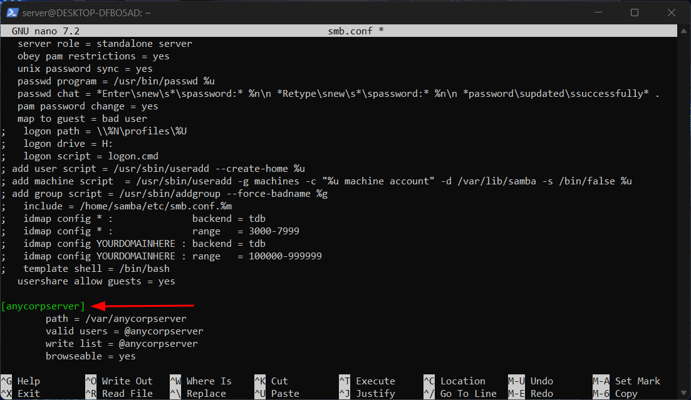

# Criando servidor compartilhado Linux/Windows

Today we will learn how to create a shared server on Linux so that Windows users can access it directly.

I decided to create this repository to show how we can configure shared remote access for customers who use local physical servers or cloud structures.

Without further ado... let's get to the point.

<br/>
<br/>
<br/>

# Configuration: Installing WSL

###### For everything to work, you must either have a physical machine that runs Linux or a virtual machine or Linux subsystem for Windows (WSL).

###### In this case I will use WSL as a matter of preference.

First step:

Open PowerShell and install WSL on Windows with the following command:

````
wsl --install
````

- This will create an Ubuntu machine by default, but you can change it easily as you see fit.

If you want to switch distributions, run the command:

````
wsl --list --online 
````

- This will show you the available distributions for installation.

In my case, I will install Debian:

````
wsl --install -d Debian 
````

After installation, let's update the dependencies and packages on our machine:

````
sudo apt update && sudo apt upgrade
````

I personally like to have two tools installed for working with networks: [Wireless Tools](https://hewlettpackard.github.io/wireless-tools/Tools.html) and [Net Tools](https://www.kali.org/tools/net-tools/).

So, I'll install them using the command:

````
sudo apt install -y net-tools wireless-tools
````

You will also need the `systemctl` command, and to set it up, you can follow this tutorial here to get it working:

- [Setting up Debian on WSL2 with Systemd](https://avivarma1.medium.com/setting-up-debian-on-wsl2-with-systemd-fb4831dd7b82) 

<br/>
<br/>
<br/>

# Creating users, groups, and limiting access

In our scenario, we will create a folder where people can share their files and information.

To do this, let's create a folder in the directory "**/var/shared-folder-name**".

**Note:** _You can give the folder any name you prefer, but in this "**educational**" context, we will create it with the name "**anycorpserver**"._

````
mkdir /var/anycorpserver
````

````
ls /var
````

Now let's create the owner group of "**anycorpserver**" folder.

````
addgroup anycorpserver
````

And after that, create the user that will belong to that group.

````
adduser jane --ingroup anycorpserver
````



You can check the "**anycorpserver**" folder's permission running the "**ls -l /var/**"



As you can see, the folder belongs to root.

The first "**root**" refers to the folder's owner.

The second one refers to the group.

To change this run the following command

````
chgrp anycorpserver /var/anycorpserver
````


Once you changed the group permisions, it's time to change the folder permissions.

````
chmod 770 /var/anycorpserver/
````



<br/>
<br/>
<br/>

# Creating samba user access 

This is an important step, because if you overstep or miss it, there's no way it can work.

So, for the user be able to access tha Linux server into the Windows machine, we need to create a user inside the samba server.

As we previously created the user Jane, now we need to give her a password to authenticate into the "**anycorpserver**".

````
smb passwd -a jane
````


<br/>
<br/>
<br/>


# Structuring SMB Connection and Protocols

Now let's install the Samba tools to begin setting up access.

````
sudo su
````

````
apt install -y samba sbmclient winbind
````

You can learn more about these tools on [samba.org](https://www.samba.org/).

After installing the packages, we need to access the Samba configuration file (**smb.conf**).

For security reasons, I like to make a local backup of the configuration file.

````
cd  /etc/samba
````

````
cp smb.conf smb.conf.bkp
````

You can check using the "**cat**" command.

````
cat smb.conf.bkp
````
As you can see, this file has a lot of comments which can clutter it up.

So let's copy only the content that interests us into **smb.conf**:

`````
egrep -v "^#|^$" smb.conf.bkp > smb.conf
`````

Now, verify if the file is correct and the information is there:

````
cat smb.conf.bkp
````

Once you have the clean file, let's open nano to edit its content:

````
nano /etc/samba/smb.conf
````


For this specific case i did erase all the content above global section.

And then added the "**anycorpserver**" configuration.

- **path = /var/anycorpserver** - is the shared folder's path
- **valid users = @anycorpserver** - refers to the allowed users of this folder
- **write list = @anycorpserver** - means that only this group can write into the anycorpserver folder
- **browseable = yes** - it makes sure that you can browse the files into your Windows machine

<br/>
<br/>
<br/>

# Authenticating 

Now, let's copy and paste or ip address into the Windows execution command.

`````
\\172.21.176.218\anycorpserver
`````

